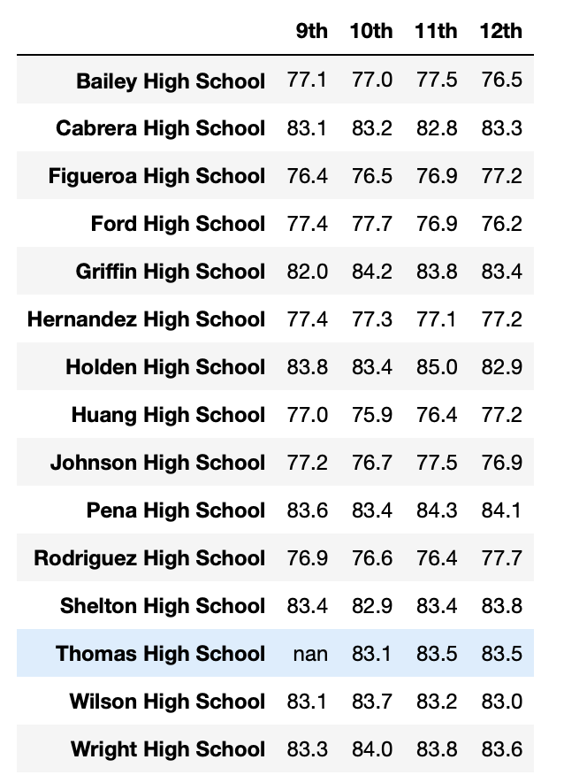

# PyCitySchools with Pandas
## Overview of School District Analysis

The study looked at a data set of 39,170 students of a school district of 15 high schools. The standardized test scores of these students were analyzed and then aggregated in different ways to identify trends in student performance.  

Due to suspected academic dishonesty of Grade 9 students of Thomas High School, the analysis replaced their reading and math grades to uphold state-testing standards. The study aims to determine the effects of these changes on the outcomes of the school district analysis. Results of the study will guide the school board in making decisons regarding the school budget and priorities. 

## Results
 
District Summary
 

</img>
- Effect on District Summary: 
    - Average Math Score decreased from 79.0 to 78.9
    - % Passing Math decreased from 75% to 74.8%
    - % Passing Reading decreased from 86% to 85.7%
    - % Overall passing decreased from 65% to 64.9 %
    
  
Summary Per School
    

</img>
- Effect on School Summary:
    - Average Math Score decreased from 83.418349 to 83.350937. 
    - Average Reading Score increased from 83.848930 to 83.896082. 
    - % Passing Math of Thomas High School decreased from 93.272171% to 93.185690%. 
    - % Passing Reading of Thomas High School decreased from 97.308869% to 97.018739%. 
    - % Overall passing of Thomas High School decreased from 90.948012% to 90.630324%. 
    
 
Top 5 Schools 
 
</img>
 
Bottom 5 Schools 
 

</img>
- Effect of replacing the ninth graders’ math and reading scores on Thomas High School’s performance relative to the other school: 
    - Although Thomas High School experienced a slight drop of less than 1 percentage point in % overall passing, its ranking comapred to other schools in this catgeory remained the same (second place). 

 
Math Scores by Grade
 
</img>
 
 
Reading Scores by Grade
 

</img>
- Effect on Math and Reading scores by grade: 
    - The average  Math and Reading Scores of Grade 10-12 students in Thomas High School were unaffected.
    - Average Math and Reading Scores of Grade 9 students in Thomas High School (THS) were removed and replaced with "nan" after formerly being 83.6 and 83.7 respectively. 

 
Spending Summary
 

</img>
- Scores by school spending: 
    - The average math score, average reading score, % passing math, % passing reading and % overall passing filtered for every spending range were unaffected by the change. 

 
Size Summary
 

</img>
- Scores by school size: 
    - The average math score, average reading score, % passing math, % passing reading and % overall passing filtered for every school size were unaffected by the change. 

 
Type Summary
 

</img>
- Scores by school type: 
    - The average math score, average reading score, % passing math, % passing reading and % overall passing filtered for every school type were unaffected by the change. 

## Summary

After changing the values of the math and reading scores of the Grade 9 students of Thomas High School, the following changes were observed: 

Firstly, the total number of students in Thomas High School who passed math, passed reading, and passed overall changed to 1094, 1139, and 1064 respectively. These changes influenced the % Passing Math, % Passing Reading, and % Overall on multiple levels. 

Secondly, the % Passing Math, % Passing Reading, and % Overall passing of Thomas High School all decreased by about 0.09, 0.29, and 0.32 percentage points respectively. In addition, the average math score decreased by about 0.07 points while the average reading score increased by around 0.05 points. The overall impact of these changes due to suspected cheating is minimal on the passing statistics of the school.  

Thirdly, Thomas High School remains as the second best performing school in the district in terms of % overall passing. Despite these changes, around 90% to 91% of its students still pass both Math and Reading. 

Fourthly, these changes are felt even less on the school district level. The % Passing Math, % Passing Reading and % Overall Passing of the 15 schools in this district decreased by 0.2, 0.3 and 0.1 percentage points respectively. The district summary also revealed that only the average math scores of these schools changed by 0.1 point. Despite these changes, around 65% of the students in this district still pass both Math and Reading. 

